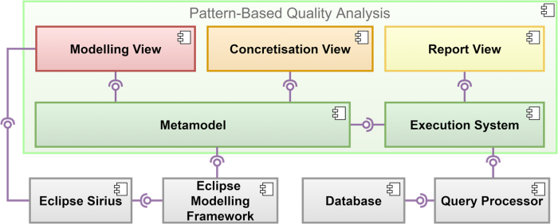
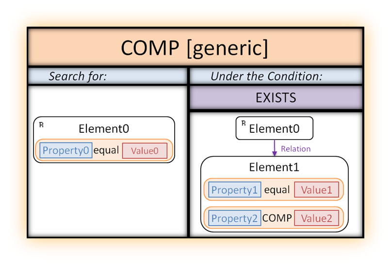
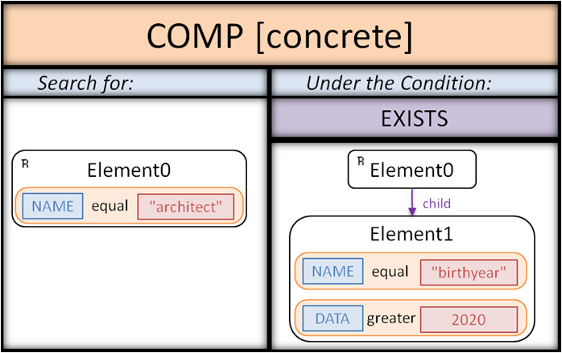
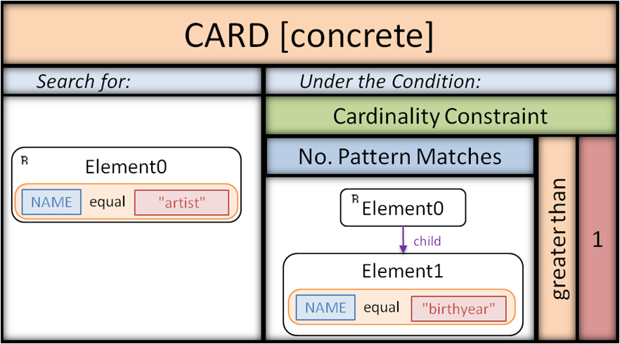
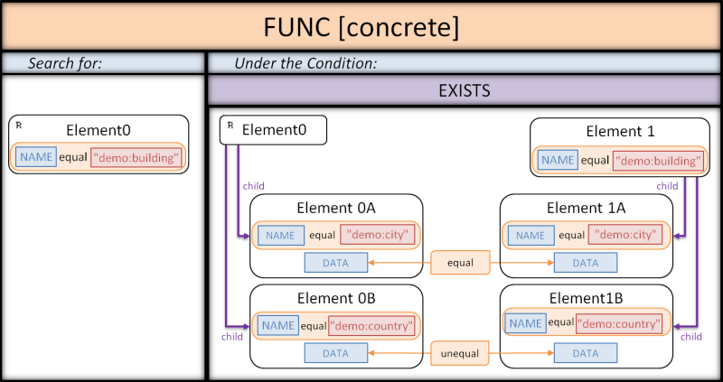

# Quality Pattern Model

This tool is a proof of concept for a model-driven approach to analyze the quality of research data.
It supports the specification of anti-patterns for data quality problems.
These anti-patterns are generic with respect to database technologies and formats.
Generic patterns can be adapted to several database technologies, resulting in several abstract patterns.
An abstract pattern can be concretisized for a domain-specific database format and concrete quality problem. 
The resulting concrete patterns can be utilized to locate quality problems in databases.
As proof of concept, this project realizes this approach for databases in XML, RDF and Neo4j.

This approach is based on the observation of a dynamic digitalisation (resulting in a variety of database technologies employed) and a variety of data quality problems occurring in research data.

The approach is described in detail in the research paper "[Detecting Quality Problems in Research Data: A Model-Driven Approach](https://dl.acm.org/doi/10.1145/3365438.3410987)", published in the [proceedings](https://dl.acm.org/doi/proceedings/10.1145/3417990) of the conference "[MODELS2020](https://conf.researchr.org/home/models-2020)".





This diagram gives an overview of the components and their interfaces.
The implementation includes a metamodel for the patterns, a pattern execution system and a front-end.
In accordance with the outlined workflow, the tool, first of all, allows creating generic patterns via a Sirius modelling workbench.
It contains a set of predefined generic example patterns for detecting typical data quality problems.
The tool further supports the semi-automatic adaption of generic patterns to different database technologies via the modelling view.
The concretisation of an adapted abstract pattern can be achieved by specifying the pattern’s parameters in a form-based view.
Finally, a concrete pattern is automatically translated into a corresponding query language.
The execution system allows the application of the pattern to a database.
For example, XML is using BaseX as XQuery processor.
The result of the pattern application is presented to the user via the report view.

The metamodel and pattern execution system are implemented in the project called ```qualitypatternmodel```.
The graphical user interface is implemented in the gui branch in the project called ```patterncreation.project.design```.


## Built With

* [Eclipse](https://www.eclipse.org/ide/)
* [Eclipse Modelling Framework](https://www.eclipse.org/modeling/emf/)
* [Eclipse Sirius](https://www.eclipse.org/sirius/)
* [XQuery](https://www.w3.org/XML/Query/)
* [BaseX](https://basex.org)
* [everit-org/json-schema](https://github.com/everit-org/json-schema)


## Prerequisites

* Eclipse 4.12.0
* Eclipse Modeling Framework 2.18.0
* Eclipse Sirius 6.2
* Eclipse OCL (OCL Classic SDK 5.9.0 and OCL Examples and Editors SDK 6.8.0)
* JUnit 5

## Installation

1. Download Eclipse installer for Eclipse 2022-09 R from [https://www.eclipse.org/downloads/](https://www.eclipse.org/downloads/)
2. Install "Eclipse Modelling Tools" from the installer
3. Install Eclipse OCL from the Eclipse Marketplace
4. Import the qualitypatternmodel framework from this repository into the Eclipse Workspace

## Tests

Tests concerning the correctness of the translation of concrete patterns are contained in the package ```qualitypatternmodel.test```.
The tests are splitted into translation tests, where all components are validated by system tests with artificial patterns, and evaluation tests, that contain patterns, that can be applied to real databases.
Such tests are done for all supported database technologies, namely XML, RDF and Neo4j.

## Examples

In the following we will briefly present three example patterns for XML data, called `COMP`, `CARD` and `FUNC`.
They allow detecting quality problems in a demo XML database on cultural heritage objects.
The demo database and the corresponding schema can be found in the folder `demo.data`.

The class `qualitypatternmodel.demo/DemoPatterns` includes the programmatical creation of the example patterns.
For each of the three examples it includes three methods:

* `getGeneric___Pattern()` returns the generic pattern.
* `getAbstract___Pattern()` adapts the generic pattern to XML and returns the resulting abstract pattern.
* `getConcrete___Pattern(Database)` concretizes the abstract pattern for the demo database and returns the resulting concrete pattern.

When the class is executed, the following steps are performed:

* `exportAllDemoPatterns()`: The patterns are exported to XMI files in the folder `instances/demo`.
* `printAllDemoPatternQueries()`: The XQuery expressions generated from the three concrete patterns are printed to the console.
* `executeAllDemoPatterns()`: The concrete patterns are applied to the demo database and the detected problematic XML elements are printed to the console.

In the following we will present visualizations of the concrete patterns and corresponding snippets of problematic data taken from the demo database.


### COMP Pattern


The depicted example pattern is a generic pattern for detecting simple interval violations.
It searches for `Element0`s (identified via a `Property0`) that are related to an `Element1` (identified via a `Property1`), whose `Property2` is outside a specific range.



```xml
<demo:architect demo:id="301">
	<demo:name>William Frederick Lamb</demo:name>	
	<demo:birthyear>2883</demo:birthyear>
</demo:architect>
```

The depicted example data includes one quality problem: the birth year is stated to be in the future.
This quality problem represents an interval violation and thus decreases the data’s correctness.
We will now take a closer look at how architect records that include occurrences of this problem can be detected.
In general, our patterns consist of two parts: a context graph and a condition.
The context graph defines the elements that the pattern is searching for.
Ultimately, these elements are selected by the pattern if they satisfy the condition, which is a first-order logic expression over graphs.
The depicted concrete pattern searches for XML elements with the name ```demo:architect```.
They are selected if they contain an XML element with the name ```demo:birthyear``` that has a data value greater than ```2021```.


### CARD Pattern


```xml
<demo:artist demo:id="402">
	<demo:name>Leonardo Da Vinci</demo:name>
	<demo:birthyear>1452</demo:birthyear>
	<demo:birthyear>1453</demo:birthyear>	
</demo:artist>
```

In the example data, two birth years are given for the artist.
This represents a violation of a cardinality constraint, which indicates uncertain information.
The concrete CARD pattern allows detecting this problem.
For each ```demo:artist``` element, it checks whether the inner pattern matches more than once, thus whether multiple ```demo:birthyear``` elements are contained.


### FUNC Pattern


```xml
<demo:building demo:id="101">
	<demo:name>Empire State Building</demo:name>
	<demo:city>New York City</demo:city>
	<demo:country>USA</demo:country>		
</demo:building>	

<demo:building demo:id="102">
	<demo:name>Chrysler Building</demo:name>
	<demo:city>New York City</demo:city>
	<demo:country>unknown</demo:country>	
</demo:building>
```

This data snippet includes a violation of a functional dependency.
It indicates that both buildings are located in the same city but different countries.
This problem can be detected via the depicted FUNC pattern.
As the graph shows, the pattern detects ```demo:building``` elements that contain equivalent ```demo:city``` elements but different ```demo:country``` elements.


## Authors

* Arno Kesper - [arno.kesper@uni-marburg.de](mailto:arno.kesper@uni-marburg.de?subject=[GitHub]%20Quality%20Pattern%20Model)
* Viola Wenz - [viola.wenz@uni-marburg.de](mailto:viola.wenz@uni-marburg.de?subject=[GitHub]%20Quality%20Pattern%20Model)
* Lukas Tympel - [tympel@students.uni-marburg.de](mailto:tympel@students.uni-marburg.de?subject=[GitHub]%20Quality%20Pattern%20Model)
* Lukas Hofmann - [hofman5c@students.uni-marburg.de](mailto:hofman5c@students.uni-marburg.de?subject=[GitHub]%20Quality%20Pattern%20Model)
* Gabriele Taentzer - [taentzer@uni-marburg.de](mailto:taentzer@uni-marburg.de?subject=[GitHub]%20Quality%20Pattern%20Model)

This work emerged from the research project "[KONDA](https://zenodo.org/communities/konda-project)". 


## License

GNU Lesser General Public License v3.0

