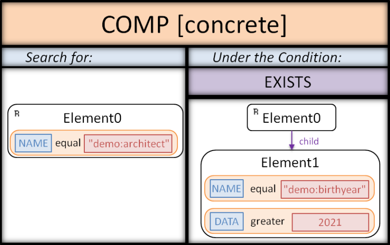
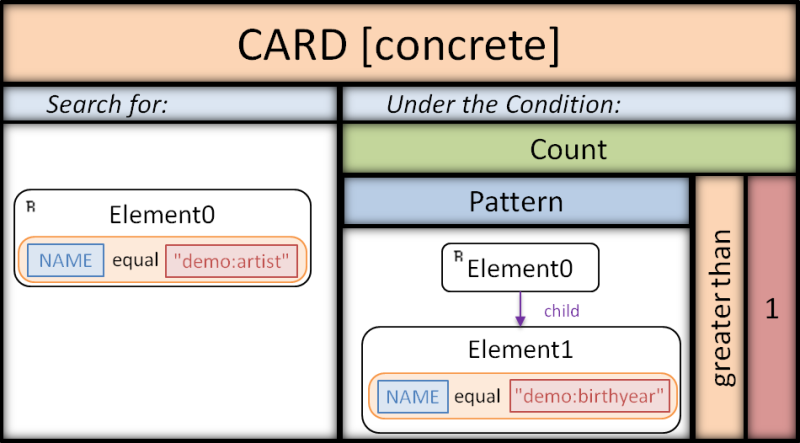

# Quality Pattern Model

This tool is a proof of concept for a model-driven approach to analyze the quality of research data.
It supports the specification of anti-patterns for data quality problems.
These anti-patterns are generic with respect to database technologies and formats.
Generic patterns can be adapted to several database technologies, resulting in several abstract patterns.
An abstract pattern can be concretisized for a domain-specific database format and concrete quality problem. 
The resulting concrete patterns can be utilized to locate quality problems in databases.
As proof of concept, this project realizes this approach for XML databases.

This approach is based on the observation of a dynamic digitalisation (resulting in a variety of database technologies employed) and a variety of data quality problems occurring in research data.

The approach is described in detail in the research paper "[Detecting Quality Problems in Research Data: A Model-Driven Approach](https://dl.acm.org/doi/10.1145/3365438.3410987)", published in the [proceedings](https://dl.acm.org/doi/proceedings/10.1145/3417990) of the conference "[MODELS2020](http://www.modelsconference.org)".

+ GUI in development?


## Authors

* Arno Kesper - [arno.kesper@uni-marburg.de](mailto:arno.kesper@uni-marburg.de?subject=[GitHub]%20Quality%20Pattern%20Model)
* Viola Wenz - [viola.wenz@uni-marburg.de](mailto:viola.wenz@uni-marburg.de?subject=[GitHub]%20Quality%20Pattern%20Model)
* Gabriele Taentzer - [taentzer@uni-marburg.de](mailto:taentzer@uni-marburg.de?subject=[GitHub]%20Quality%20Pattern%20Model)

This work emerged from the research project "[KONDA](https://zenodo.org/communities/konda-project)". 


## License

???


## Built With

* [Eclipse Version: 2019-09 R (4.13.0)](https://www.eclipse.org/downloads/packages/release/2019-09/r)
* [Eclipse Modelling Framework](https://www.eclipse.org/modeling/emf/)
* [XQuery](https://www.w3.org/XML/Query/)
* [BaseX](https://basex.org)
* [Eclipse Sirius](https://www.eclipse.org/sirius/)


## Installation
...

+ Eclipse Version: 2019-09 R (4.13.0)
+ (Eclipse Sirius 6.2)
+ import project
+ project files: packages, 


## Tests

...

* translation tests: qualitypatternmodel.translationtests / TranslationTests.java
* executable file, which tests various features of the


## Examples

In the following we will briefly present three example patterns, called `COMP`, `CARD` and `FUNC`.
They allow detecting quality problems in a demo XML database on cultural heritage objects.
The demo database and the corresponding schema can be found in the folder `demo.data`.

The class `qualitypatternmodel.demo/DemoPatterns.java` includes the programmatical creation of the example patterns.
For each of the three examples it includes three methods:

* one method that returns the generic pattern,
* a second method that adapts the generic pattern to XML and returns the resulting abstract pattern,
* and a third method that concretizes the abstract pattern for the demo database and returns the resulting concrete pattern.

When the class is executed, the following steps are performed:

* The patterns are exported to XMI files in the folder `instances/demo`.
* The XQuery expressions generated from the three concrete patterns are printed to the console.
* The concrete patterns are applied to the demo database and the detected problematic XML elements are printed to the console.

In the following we will present visualizations of the concrete patterns and corresponding snippets of problematic data taken from the demo database.


### COMP Pattern


```xml
<demo:architect demo:id="301">
	<demo:name>William Frederick Lamb</demo:name>	
	<demo:birthyear>2883</demo:birthyear>
</demo:architect>
```

The depicted example data includes one quality problem: the birth year is stated to be in the future.
This quality problem represents an interval violation and thus decreases the data’s correctness.
We will now take a closer look at how architect records that include occurrences of this problem can be detected.
In general, our patterns consist of two parts: a context graph and a condition.
The context graph defines the elements that the pattern is searching for.
Ultimately, these elements are selected by the pattern if they satisfy the condition, which is a first-order logic expression over graphs.
The depicted concrete pattern searches for XML elements with the name ```demo:architect```.
They are selected if they contain an XML element with the name ```demo:birthyear``` that has a data value greater than ```2020```.


### CARD Pattern


```xml
<demo:artist demo:id="402">
	<demo:name>Leonardo Da Vinci</demo:name>
	<demo:birthyear>1452</demo:birthyear>
	<demo:birthyear>1453</demo:birthyear>	
</demo:artist>
```

In the example data, two birth years are given for the artist.
This represents a violation of a cardinality constraint, which indicates uncertain information.
The concrete CARD pattern allows detecting this problem.
For each ```demo:artist``` element, it checks whether the inner pattern matches more than once, thus whether multiple ```demo:birthyear``` elements are contained.


### FUNC Pattern


```xml
<demo:building demo:id="101">
	<demo:name>Empire State Building</demo:name>
	<demo:city>New York City</demo:city>
	<demo:country>USA</demo:country>		
</demo:building>	

<demo:building demo:id="102">
	<demo:name>Chrysler Building</demo:name>
	<demo:city>New York City</demo:city>
	<demo:country>unknown</demo:country>	
</demo:building>
```

This data snippet includes a violation of a functional dependency.
It indicates that both buildings are located in the same city but different countries.
This problem can be detected via the depicted FUNC pattern.
As the graph shows, the pattern detects ```demo:building``` elements that contain equivalent ```demo:city``` elements but different ```demo:country``` elements.

